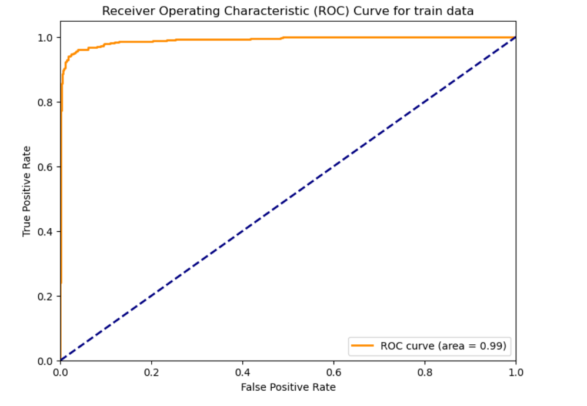

# Project 2: Spam Classifier using Word Embeddings

## Overview
In this project, I developed a spam classifier using word embeddings. The dataset, obtained from Kaggle, was used to train a dense neural network model to predict whether an email was ham or spam.

## Data Preprocessing
Spacy was utilized for text cleaning, which involved removing stop words and punctuation to enhance the quality of the text data.

## Feature Engineering
For feature engineering, word vectors were generated using Gensim. The following hyperparameters were employed:
- Vector size: 20
- Window: 7
- Min count: 1
- Skip-gram: 1

The embeddings were obtained by training the model on the text available in the dataset.

## Machine Learning Model
A dense neural network model was implemented with ReLU and sigmoid as activation functions.

## Model Performance
The cutoff value for classification was set at 0.50.
- **Train AUC:** 0.99
  
  
     <!-- Adding line breaks for spacing -->
  
- **Test AUC:** 0.96
  
     <!-- Adding line breaks for spacing -->
  
- **Train Accuracy:** 98%
  
  
     <!-- Adding line breaks for spacing -->
  
- **Test Accuracy:** 96.5%
  
      <!-- Adding line breaks for spacing -->

These results indicate robust performance of the spam classifier on both the training and test sets.

## Technologies Used
- Spacy
- Gensim
- Dense Neural Network
- Python
- Jupyter Notebook

